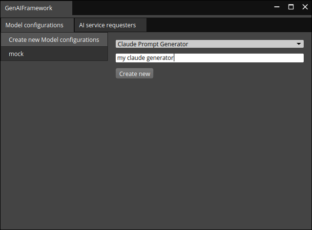
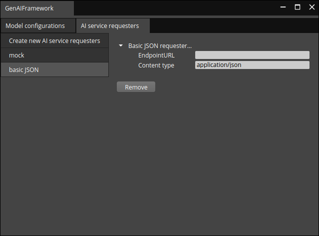
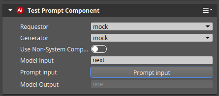
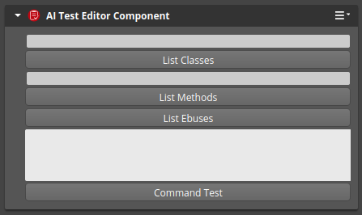

# GenAIFrameworkGem

## Setting GenAIFrameworkGem
`GenAIFrameworkGem` needs to be registered in the system so that O3DE can find the requested Gems. From the O3DE repo folder, register some or all objects using the `o3de register` command.
The following command allows to register a single Gem:
```bash
scripts\o3de.bat register --gem-path <o3de-genai-gem>/Gems/GenAIFramework
```
The following command adds a registered Gem to the O3DE project:
```bash
scripts\o3de.bat enable-gem --gem-name GenAIFrameworkGem --project-name <project name>
```

For a complete tutorial on project configuration, see [Creating Projects Using the Command Line Interface](https://o3de.org/docs/welcome-guide/create/creating-projects-using-cli/) in the documentation.

## Basic usage
When loaded, the system component of this Gem should appear in O3DE toolbar and the _Tools__ section of the menu bar. It automatically detects available Gen AI _vendor_ Gems and allows adding them through the provided UI. The widget is meant to configure the model and the AI service that runs this model. After any of the two is added to the framework, it can be configured via the widget and used by the Gen AI _feature_ Gems. The widget stores the configuration in a _setreg_ file, so it can be reloaded and shared if needed. Finally, it allows the removal of the configurations that were added earlier.

A sample screenshot of adding a new model configuration besides the previously added _mock_ configuration is given below.



A sample screenshot of AI Service Configuration named _basic JSON_ follows (note the _mock_ configuration alongside).



### Test Components
Two test components (Editor) are provided for the tests. The first one, `AI Test Prompt Component`, connects to the Gen AI _vendor_ Gem using the configurations set in the widget and allows to send a prompt (and receive the outcome). 



The latter, `Test Editor Component`, was implemented to test O3DE functionalities that could be further used in the AI. The output is printed to the _console_.



## Asynchronous AI API for Python usage
The API allows you to get responses from AI services in an asynchronous way. 
It is based on the `AZ::EBus` and `AZ::BehaviorContext`. 

Selecting an available AI service and model configuration can be done by first getting all available models:
```python
import azlmbr.ai
import azlmbr.bus as bus
serviceProvidersNames = azlmbr.ai.GenAIFrameworkRequestBus(bus.Broadcast, 'GetServiceProviderNames')
modelConfigurationsNames = azlmbr.ai.GenAIFrameworkRequestBus(bus.Broadcast, 'GetModelConfigurationNames')
```

And after getting the available methods the models can be selected:
```python
result = azlmbr.ai.asyncRequestBus(bus.Broadcast, 'SetServiceProviderByName', 'example_name')
result = azlmbr.ai.asyncRequestBus(bus.Broadcast, 'SetModelConfigurationByName', 'example_name')
```
The result is true if the model configuration or service provider is found and set. False otherwise. It is also possible to verify which model configuration or service provider is currently set by calling the following:
```python
providerName = azlmbr.ai.asyncRequestBus(bus.Broadcast, 'GetActiveServiceProviderName')
modelConfiguration = azlmbr.ai.asyncRequestBus(bus.Broadcast, 'GetActiveModelConfigurationName')
```
The output name might be empty in the case of a service provider or model configuration respectively being not set.

Sending a prompt example:
```python
ticket = azlmbr.ai.asyncRequestBus(bus.Broadcast, 'SendPromptToLLM', "Hello World")
```
The ticket is a random identifier used to identify the response.

You can ask if the response is ready using the following example:
```python
is_ready = azlmbr.ai.asyncRequestBus(bus.Broadcast, 'IsResponseReady', ticket)
print(is_ready)
```

Use the subsequent code snippet to get the response (when available):
```python
response = azlmbr.ai.asyncRequestBus(bus.Broadcast, 'GetResponse', ticket)
print(response)
```

To get registered name of the currently used model configuration or service provider use:
```python
registered_name = azlmbr.ai.asyncRequestBus(azlmbr.bus.Broadcast, "GetModelConfigurationTypename")
registered_name = azlmbr.ai.asyncRequestBus(azlmbr.bus.Broadcast, "GetServiceProviderTypename")
``` 

To reset the model history, use the following code snippet:
```python
azlmbr.ai.asyncRequestBus(bus.Broadcast, 'ResetModelHistory')
```

Changing the model configurations can be done by calling the following:
```python
result = azlmbr.ai.asyncRequestBus(bus.Broadcast, "SetModelParameter", "systemMessage", "This is a test system message")
```
The result will be an empty string if the model parameter is set successfully. Otherwise, it will contain an error message.

To enable or disable the model history, use the following code snippet:
```python
# Enable model history
azlmbr.ai.asyncRequestBus(bus.Broadcast, 'EnableModelHistory', True)
# Disable model history
azlmbr.ai.asyncRequestBus(bus.Broadcast, 'EnableModelHistory', False)
```

## License
For terms please see the LICENSE*.TXT files at the root of this distribution.
