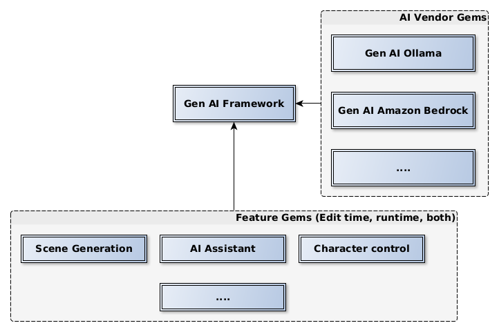

# O3DE Generative AI Gems collection

The `o3de-genai-gems` repository serves as a hub for the development and distribution of O3DE Gems developed to support Generative AI models within O3DE. In particular, it contains the core Gem of the Generative AI O3DE Framework, a sample Generative AI Feature Gem for assisting with O3DE-related questions and a collection of Generative AI Vendor Gems to support the communication between the AI client and AI server.

## Introduction

[Open 3D Engine](https:://o3de.org) - an open-source game & simulation engine. O3DE is extendable through modules called Gems. This repository is a collection of such Gems related to one functionality.

**Generative AI O3DE Framework** is a framework that enables employing Generative AI in specific tasks in O3DE. Three main components build this framework:
1. A core framework Gem that is intended for developers to build on. It is a bridge between the user, O3DE and the AI: other Gems will use it to build features powered by Generative AI.
2. A collection of vendor Gems used to connect to specific AI services or models.
3. A collection of feature Gems that execute certain functionalities in O3DE based on Gen AI responses, such as level generation/modification or character control.

In other words, a feature Gem prepares the query to the Generative AI (e.g. asks to modify the level's layout given the current layout) based on the user's input and a vendor Gem is responsible for converting this query into a meaningful format and connecting with a given AI model. _GenAIFramework_ Gem connects the two, i.e., it ensures that all vendor Gems are available for feature Gems. Importantly, it also provides the user interface for AI communication. The framework is summarized in the picture below.

More details about the architecture of the system are given in the [Request for Comments (RFC)](https://github.com/o3de/sig-simulation/issues/87) document.

## Architecture details

### Data flow

The starting point for any AI pipeline within O3DE is a chat widget that creates a conversation. Each conversation defines a feature (this can be understood as a conversation topic) and the AI Agent used in that conversation (consisting of model configuration and a service provider). A sample configuration of such a conversation is given in a Getting Started [document](./docs/gettingStarted.md).

After the conversation is created, it is possible to prompt AI with any question via a feature Gem and a vendor Gem. The data flow looks as follows:

The interfaces marked in bold are implemented in `GenAIFramework Gem`. The data passed in the specific interfaces is the following:
* (A): user input (text message)
* (B): internal communication in the feature Gem between the interface and the feature logic
* (C), (D): communication between the feature and the engine to get extra context needed to solve the user's request
* (E): internal communication in the feature Gem between the interface and the feature logic
* (F): user input with additional context generated by the feature (typically represented as a system message)
* (G): user input with additional context formatted to match the AI model's requirements (typically JSON format)
* (H), (I): communication between O3DE Agent and the service provider (service provider's API)
* (J): response from the AI in a format given by model (typically JSON format)
* (K): response from the AI in an internal format (unified for all models)
* (L): feature output displayed in the UI (text message)

> *Note*: In order to solve the task requested by the user, the feature makes use of (B) - (E) interfaces before sending a response (L). A feature might run the AI pipeline (F) - (K) multiple times before terminating with the final message. Moreover, the system allows to send intermediate messages from the feature back to the interface (L) while running such loop to keep the user notified about the progress.

### Framework Gem
`GenAIFramework Gem` provides a centralized mechanism for integrating users with a diverse array of AI tools. To facilitate this connection, each AI tool - including vendor Gems and feature Gems - must first be registered within the O3DE ecosystem using the framework's standardized interface. The chat widget is available for creating conversations using a selected set of AI components: features, AI models, and AI service providers. This unified interface enables users to easily discover, select, and utilize various AI capabilities within their application. Developers can extend the system by adding support to more AI models and more service providers, or more AI features. Once registered, these AI tools become accessible via a user interface. 

To integrate an AI tool into O3DE, developers can implement a feature Gem entirely in Python, with minimal C++ effort required for registering the Gem. This approach provides maximum flexibility and ease of implementation. There are two options to connect the AI feature with service providers. First, you can utilize the existing pipeline to connect with AI service providers via C++ vendor Gems. Alternatively, you can connect with the AI vendor of your choice directly from the feature Gem without interfering with vendor Gems. This option would be a better option if you plan to develop your feature in Python language, as it provides a more streamlined and Python-centric integration experience and allows for feature development tailored to a specific model's interface. The `GenAIFramework Gem` provides a set of Python interfaces that enable seamless integration of existing AI tools with the O3DE interface. This allows developers to leverage their existing knowledge and expertise in AI tool development in Python while still benefiting from the O3DE ecosystem. 

The information about `GenAIFramework Gem` can be found on dedicated documentation pages. This includes a detailed description of [all interfaces](./docs/interfaces.md) available in `GenAIFramework Gem` connecting feature Gems with vendor Gems, the details about available [Python support](./docs/python.md) in `GenAIFramework Gem` and [the UI documentation](./docs/ui.md) with the sample use.

### Vendor Gems
Vendor Gems provide mechanisms to communicate with certain generative AI models running on certain servers. This repository contains two Gems that bundle multiple AI models and service definitions each:
- `GenAIVendorBundle`: a vendor Gem that implements communication with [Anthropic](https://docs.anthropic.com/en/docs/welcome) service for running `Claude` model and [Ollama toolset](https://github.com/ollama/ollama) that allows getting up and running various language models locally.
- `GenAIAmazonBedrockVendorBundle Gem`: a vendor Gem that implements communication with [Amazon Bedrock service](https://aws.amazon.com/bedrock/) and that offers a choice of high-performing models from leading AI companies. This gem is dependent on the `GenAIVendorBundle` Gem and allows for communication with the `Claude` model using the `Amazon Bedrock` service.
- `GenAIMock`: a mocked vendor Gem that can produce predictable responses based on the given input data in JSON format. This Gem is meant for cost-effective and fast tests as well as a sample implementation of a vendor Gem.

To learn more about the available vendors and find a guide for the configurations, see the [vendors'](./docs/vendors.md) documentation. There is also a page describing how to add a [new vendor Gem](./docs/newVendor.md). 

### Feature Gems
Feature Gems use Generative AI to deal with a certain problem in your workflow. For example, a _scene generation feature Gem_ might be responsible for creating a scene based on the user's prompt. Internally, it could connect to the asset processor to discover available assets and to the O3DE Editor to learn about the existing scene layout. Next, it could combine all necessary information and send a query to the AI. Based on the response, it could call some existing O3DE buses to add/move/remove the elements of the scene. The communication between the Generative AI and the feature is independent from the O3DE, hence the feature could iterate multiple times with the AI to find the best solution for the user's prompt. Finally, the feature should inform the user about the completion and send an answer to the prompt.

_O3DE Assistant_ feature is a part of the `GenAIFramework Gem` that can answer your questions related to the O3DE. It is implemented in C++ and serves as an example of how to implement a feature. It only does a simple modification to the user's prompt: it adds a system message for AI to inform about the context (being an _O3DE Assistant_). This implementation can be seen as documentation on how to implement a feature. More information can be found in a [new feature instruction](./docs/newFeature.md).

## Installing Generative AI Gems in your O3DE project

To use generative AI in O3DE, you need to register the `GenAIFramework Gem` in the engine and add it to your project. The same rule applies to vendor Gems and feature Gems that you might want to use. The only exception is _O3DE Assistant_ feature, which is available as a part of the `GenAIFramework Gem`. 

You can find more information about getting started with `GenAIFramework Gem` on a [dedicated readme page](./docs/gettingStarted.md). A thorough explanation of the user interface is provided [separately](./docs/ui.md).

## Contribute
For information about contributing to O3DE, visit [https://o3de.org/docs/contributing/](https://o3de.org/docs/contributing/).

## License
For terms please see the LICENSE*.TXT files at the root of this distribution.
