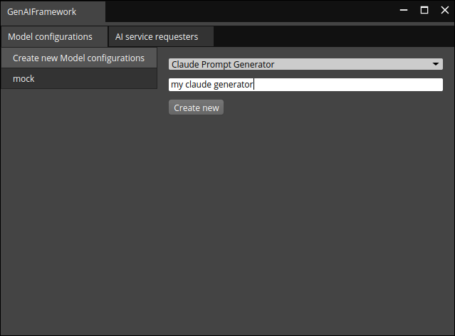
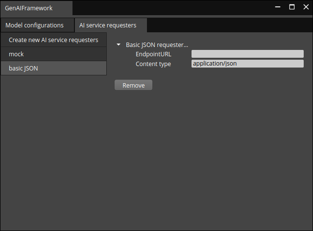
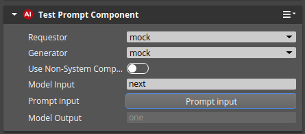
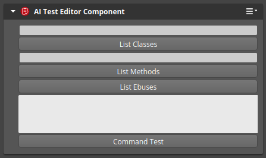

# GenAIFrameworkGem
`GenAIFrameworkGem` repo contains the core Gem of the Gen AI O3DE Framework.

## Context
[Open 3D Engine](https:://o3de.org) - an open-source game & simulation engine. O3DE is extendable through modules called Gems. This repository is a collection of such Gems related to one functionality.

**Gen AI O3DE Framework** is a framework that enables employing Generative AI in specific tasks in O3DE. Three main components build this framework:
1. [GenAIFramework](https://github.com/RobotecAI/ai-core-gem) is a core framework Gem, is intended for developers to build on. As such, it does not, by itself, do anything useful that is user-facing. Other Gems will use it to build features powered by Generative AI.
2. **Gen AI Vendor Gems** is a collection of separate Gems used to connect to specific AI services or models. This repo contains multiple examples of such Gems.
3. **Gen AI Feature Gems** is a collection of separate Gems that execute certain functionalities in O3DE based on Gen AI responses, such as level generation/modification or character control.

In other words, a feature Gem prepares the query to the Generative AI (e.g. asks to modify the level's layout given the current layout) and a vendor Gem is responsible for converting this query into a meaningful format and connecting with a given AI model. _GenAIFramework_ Gem connects the two, i.e., it ensures that all vendor Gems are available for feature Gems. The framework is summarized in the picture below.


More details about the architecture of the system are given in the [RFC](https://github.com/o3de/sig-simulation/issues/87) document.

## Setting GenAIFrameworkGem
`GenAIFrameworkGem` needs to be registered in the system so that O3DE can find the requested Gems. From the O3DE repo folder, register some or all objects using the `o3de register` command.
The following command allows to register a single Gem:
```bash
scripts\o3de.bat register --gem-path <ai-core-gem>
```
The following command adds a registered Gem to the O3DE project:
```bash
scripts\o3de.bat enable-gem --gem-name GenAIFrameworkGem --project-name <project name>
```

For a complete tutorial on project configuration, see [Creating Projects Using the Command Line Interface](https://o3de.org/docs/welcome-guide/create/creating-projects-using-cli/) in the documentation.

## Basic usage
When loaded, the system component of this Gem should appear in O3DE toolbar and the _Tools__ section of the menu bar. It automatically detects available Gen AI _vendor_ Gems and allows adding them through the provided UI. The widget is meant to configure the model and the AI service that runs this model. After any of the two is added to the framework, it can be configured via the widget and used by the Gen AI _feature_ Gems. The widget stores the configuration in a _setreg_ file, so it can be reloaded and shared if needed. Finally, it allows the removal of the configurations that were added earlier.

A sample screenshot of adding a new model configuration besides the previously added _mock_ configuration is given below.



A sample screenshot of AI Service Configuration named _basic JSON_ follows (note the _mock_ configuration alongside).



### Test Components
Two test components (Editor) are provided for the tests. The first one, `AI Test Prompt Component`, connects to the Gen AI _vendor_ Gem using the configurations set in the widget and allows to send a prompt (and receive the outcome). 



The latter, `Test Editor Component`, was implemented to test O3DE functionalities that could be further used in the AI. The output is printed to the _console_.



## Asynchronous AI API for Python usage
The API allows you to get responses from AI services in an asynchronous way. 
It is based on the `AZ::EBus` and `AZ::BehaviorContext`. 

Sending a prompt example:
```python
import azlmbr.ai;
import azlmbr.bus as bus;
ticket = azlmbr.ai.asyncRequestBus(bus.Broadcast, 'SendPromptToLLM', "Hello World")
```
The ticket is a random identifier used to identify the response.

You can ask if the response is ready using the following example:
```python
is_ready = azlmbr.ai.asyncRequestBus(bus.Broadcast, 'IsResponseReady', ticket)
print(is_ready)
```

Use the subsequent code snippet to get the response (when available):
```python
response = azlmbr.ai.asyncRequestBus(bus.Broadcast, 'GetResponse', ticket)
print(response)
```

## Contribute
For information about contributing to O3DE, visit [https://o3de.org/docs/contributing/](https://o3de.org/docs/contributing/).

## License
For terms please see the LICENSE*.TXT files at the root of this distribution.
