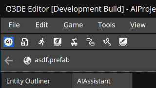
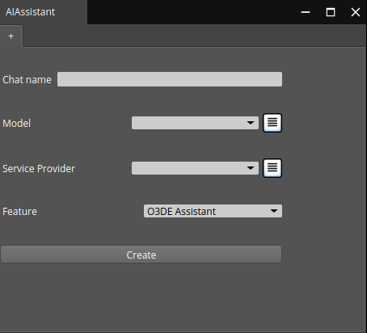
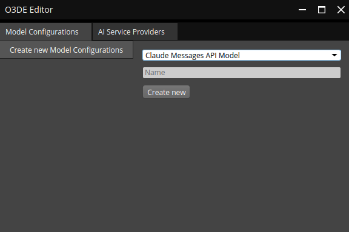
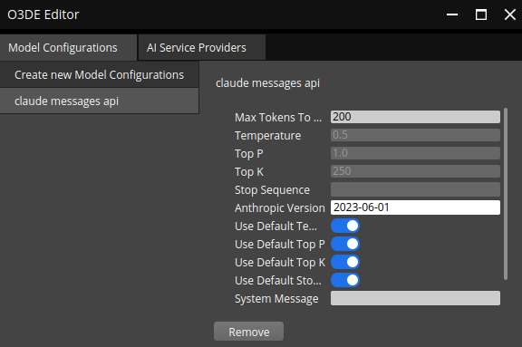
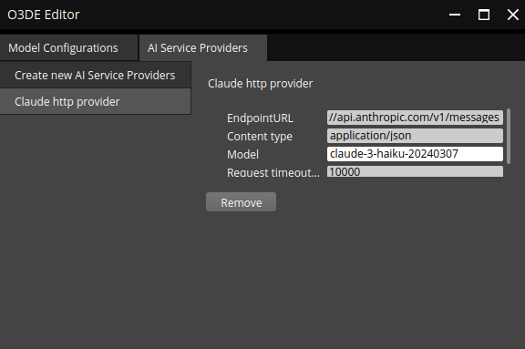
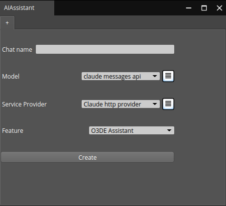
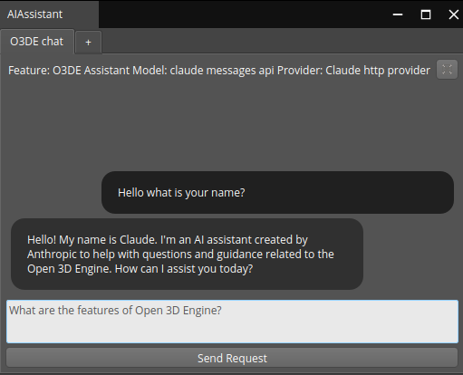

# Getting started with O3DE Generative AI Gems

This guide will walk you through the process of installing the necessary O3DE Gems, configuring a `Claude` model for `Anthropic` service, and running a basic AI Assistant using the configured model for helping with O3DE related problems.

## Installing Generative AI Gems in your O3DE project

First, register the `GenAIFramework` Gem and all vendor Gems in the O3DE engine. To do that, use `register` command of the `o3de` script in the engine's folder:
```bash
cd <o3de-directory>
scripts/o3de.sh register --gem-path <o3de-genai-gems>/Framework/GenAIFramework
scripts/o3de.sh register --all-gems-path <o3de-genai-gems>/Vendors
```
Add the registered Gems to your O3DE project:
```bash
scripts/o3de.sh enable-gem --gem-path <o3de-genai-gems>/Framework/GenAIFramework --project-name <project name>
scripts/o3de.sh enable-gem --all-gem-paths <o3de-genai-gems>/Vendors --project-name <project name>
```

For a complete tutorial on project configuration, see [Creating Projects Using the Command Line Interface](https://o3de.org/docs/welcome-guide/create/creating-projects-using-cli/) in the O3DE documentation.

## Setting up a new vendor and a chat with O3DE Assistant feature

This is an example of how to set up a vendor in O3DE. It explains how to create and use the `Claude 3` models with the `Claude HTTP` service. Other vendors can be set up similarly.
1. Add `ANTHROPIC_API_KEY` to your environment variables. This can be done using the `export ANTHROPIC_API_KEY=<your_api_key>` command, where `<your_api_key>` is the key provided by `Anthropic`.
2. Open a new project in O3DE with the `GenAIFramework` and `GenAIVendorBundle` Gems.
3. Select the `AI` icon in the upper left corner to open the `Gen AI conversations` window.



4. An `AIAssistant` window will appear.



5. Click the burger button next to the `Model` dropdown box.

6. Using the dropdown box select the `Claude messages API` model (or any other appropriate model) give it a name and click create.



7. Select the newly created model



8. Add the `Anthropic version` (example: `2023-06-01`) according to the [Anthropic documentation](https://docs.anthropic.com/en/api/messages). You can also change other fields but it is not necessary.

9.  Select the `AI Service Providers` tab and create the `Claude HTTP service provider`.

10.  Select the newly created service and fill the fields with appropriate values. You can find all available models on the [Anthropic documentation](https://docs.anthropic.com/en/docs/about-claude/models).
> _Note_: If you see a message about a missing API key, make sure to include it in your environment variables.



11.  You can now close the configuration window and the created models should be available for selection.



12.  Name the chat, select the `O3DE Assistant` feature, and click create.

## Using the AI chat window

The chat window created in the previous steps is ready to use. You can see an example with the first question and AI reply in the screenshot below:



Each chat window uses a separate context and history. Moreover, each conversation can be linked to a different AI model and serve a different feature. You can add more chat tabs by selecting the `+` tab or close the current one by clicking the `X` button in the top right corner of the chat.See more details on the user interface in a [separate documentation page](./ui.md).

> NOTE: There is a minor issue with the chat window. If its width is too small the messages can be not fully displayed. To fix this, increase the width of the chat window. Also it's best to disable fractional scaling in the system settings.

## Other features

Currently one more example feature is available - scene generation. The set up procedure is similar to the one described above. For details see the [Scene Generation feature readme](../Framework/GenAIFramework/Editor/Scripts/scene_generation/README.md).