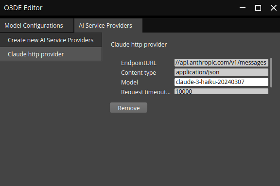

# `GenAIFramework Gem` user interface

## Creating a chat: default view

When loaded, the widget of this Gem appears in O3DE toolbar (look for `AI` icon) and the _Tools__ section of the menu bar. The system components of `GenAIFramework` Gem automatically detects available _vendor_ Gems and _feature_ Gems. All the components of the system are visible in the user interface:

The Main Window of the O3DE-Generative AI framework presents users with a centralized hub for managing their conversations. The window is divided into two primary sections: 
1. **Chat Tab Bar**: A tabbed interface that displays a list of available chats, each represented as a separate tab.
	* Initially, there is only one tab marked with the `+` character, which serves as a gateway to creating new chats.
	* Users can use this tab to establish connections between AI features and selected AI models and AI service providers, thereby initiating new conversations.
2. **Chat Content Area**: The main area of the window where users can view and interact with their existing chats. This section provides a clear overview of each chat, allowing users to easily navigate and manage their conversations.

Keep in mind, that each chat is independent from the other: the conversation history and context it not shared between different ones. Moreover, each conversation can be linked to a different AI model and serve a different feature. 

## Configuring vendors

When running the `GenAIFramework` for the first time, the lists of AI models and AI service providers will be empty. Although the _vendor_ components are automatically detected, they need to be configured before. This is done through the provided UI. Click the _burger_ icon next to the _Model_ drop-down or _Service Provider_ drop-down to open a configuration window for any of the two.

The configuration widget automatically detects all _vendor_ components, i.e., AI Models and AI Providers, and allows to add new instances of the respective components. This design increases the flexibility, as each AI Model instance can use different configuration (e.g. different temperature or timeout). The widget stores the settings in a _setreg_ file, so your configuration is loaded at the start or can be part of an O3DE project. 

The AI model configuration automatically detects all available models and lets you create a new configuration as shown below:

A sample configuration window for `Claude Messages API Model` might look as follows. See the [getting started guide](./gettingStarted.md) to learn more about configuring this model. Note, that you can remove the configuration with a dedicated button.

The window for configuring the AI service provider follows the same design principles. After a named configuration is created and all parameters are set correctly, it can be used as a backend for the AI _feature_. A sample configuration for the `Claude Http Service Provider` is presented below:

## Using a chat

After the _chat_ is created, it serves as a text interface for the user to send the requests to AI _features_. An example for the `O3DE Assistant` _feature_ linked with the `Claude` model running on `Anthropic` server is presented below:

The _chat_ window is a intuitive interface that facilitates seamless communication between users and AI components. The window consists of three primary elements:

1. **Title Bar**: A section at the top of the window that displays essential information about the chat, including:
	* The name of the feature used to create the chat
	* A list of AI components employed in the conversation
2. **Close Button (`X`)**: A simple button located in the top-right corner of the window, allowing users to quickly exit the chat by clicking on it.
3. **Message Exchange Area**: The main area of the window where users can engage in a natural-sounding conversation with the AI feature. This section enables users to:
	* Send messages to the AI feature
	* Receive responses from the AI feature
