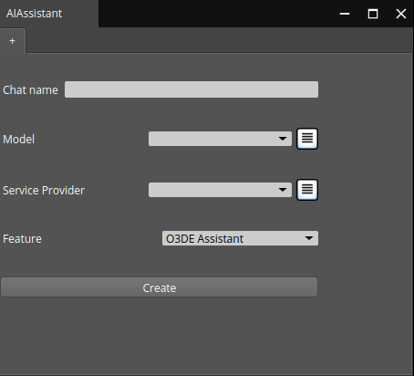
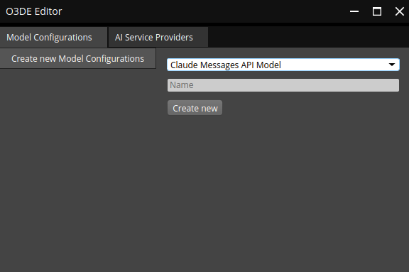
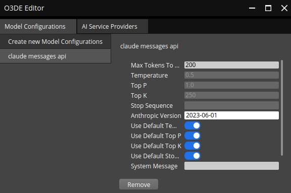
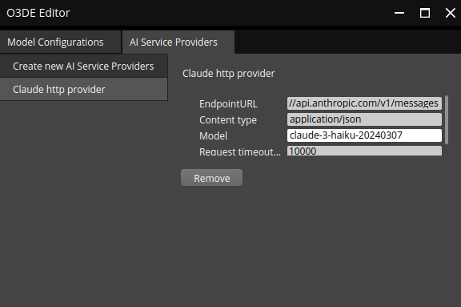
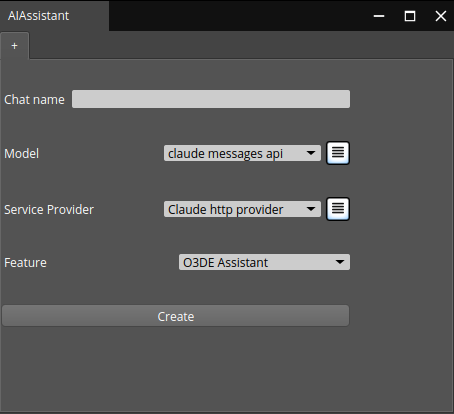
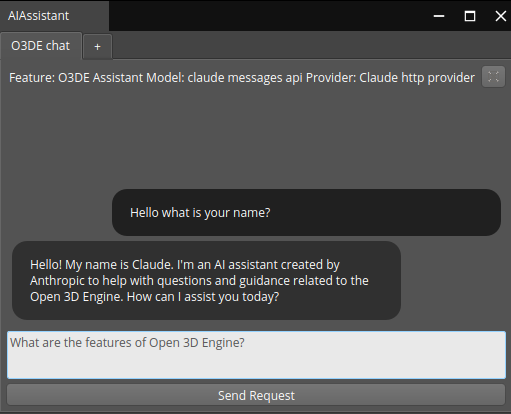

# Configuring a vendor
## Claude
This is an example of how to set up a vendor in O3DE. It explains how to create and use the `Claude 3` models with the `Claude HTTP` service. Other vendors can be set up similarly.
1. Add `ANTHROPIC_API_KEY` to your environment variables. This can be done using the `export ANTHROPIC_API_KEY=<your_api_key>` command, where `<your_api_key>` is the key provided by `Anthropic`.
2. Open a new project in O3DE with the `GenAIFramework` and `GenAIVendorBundle` Gems.
3. Select the `AI` icon in the upper left corner to open the `Gen AI conversations` window.
4. An `AIAssistant` window will appear.  

5. Click the burger button next to the `Model` dropdown box.  
6. Using the dropdown box select the `Claude messages API` model (or any other appropriate model) give it a name and click create.

7. Select the newly created model  

8. Add the `Anthropic version` (example: `2023-06-01`) according to the [Anthropic documentation](https://docs.anthropic.com/en/api/messages). You can also change other fields but it is not necessary.
9. Select the `AI Service Providers` tab and create the `Claude HTTP service provider`.
10. Select the newly created service and fill the fields with appropriate values. You can find all available models on the [Anthropic documentation](https://docs.anthropic.com/en/docs/about-claude/models).  
**Note**: If you see a message about a missing API key, make sure to include it in your environment variables.

11. You can now close the configuration window and the created models should be available for selection.

12. Name the chat and select the `O3DE Assistant` feature and click create.
13. Start the chat and try out the model.  

14. To close the conversation click on the `X` in the top right corner. To add a new conversation click on the `+` button in the tabs.

## Using the `GenAIAmazonBedrockVendorBundle` Gem
Claude models can be used with the `Amazon Bedrock` service provider. To set up the `Claude` model with `Amazon Bedrock` the `Service provider` needs to be changed. Select the `Claude Amazon Bedrock` service provider instead of the `Claude HTTP` service provider and set up the fields accordingly. Additionally, `Anthropic` version in the model configuration should be changed to match the versions specified in the [Claude Amazon Bedrock documentation](https://docs.aws.amazon.com/bedrock/latest/userguide/model-parameters-anthropic-claude-messages.html#model-parameters-anthropic-claude-messages-overview) (example `bedrock-2023-05-31`).

## Using the Ollama vendor
The `Ollama` vendor configuration is similar to `Claude`. The main difference is that `Ollama` allows for the selection of prepared models. In the `Model configuration` input the appropriate
model name (e.g. `mistral`, `llama3`).
